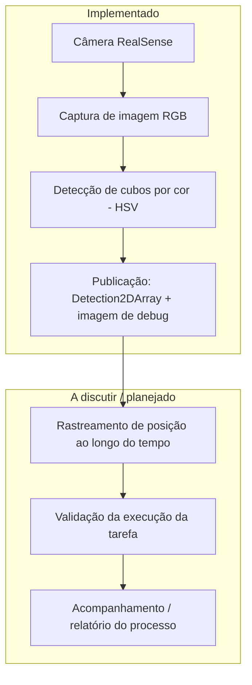

# Desk Inspector

Sistema de percepção baseado em ROS 2 (Humble) para detecção de cubos coloridos sobre uma mesa, usando uma câmera Intel RealSense. O nó principal processa imagens RGB, detecta objetos por cor (vermelho, amarelo, verde, roxo) via segmentação HSV e publica as detecções como mensagens `vision_msgs/Detection2DArray`, além de uma imagem de depuração com as caixas desenhadas.

## Motivação

O repositório `desk-inspector` nasce com o objetivo de criar uma aplicação de acompanhamento e validação da execução de tarefas por plataformas robóticas, utilizando tecnologias de detecção de objetos e o rastreamento de sua posição ao longo do tempo. A detecção de cubos coloridos implementada hoje é o primeiro passo dessa percepção: a base sobre a qual as próximas camadas (rastreamento, validação e acompanhamento) serão construídas.

## Fluxograma do processo



## Próximos passos (A discutir)

- Rastreamento da posição dos objetos detectados ao longo do tempo (tracking entre frames).
- Definição do modelo de validação: o que caracteriza sucesso, falha ou desvio de uma tarefa.
- Integração com a lógica da plataforma robótica para correlacionar detecções com etapas esperadas da tarefa.
- Persistência/histórico das detecções para auditoria do processo.
- Interface de acompanhamento (dashboard/visualização) do nível de validação da tarefa.

## Estrutura do projeto

```
desk-inspector/
├── .gitignore                      # Ignora build/, install/ e log/ (gerados pelo colcon)
├── docker/
│   └── dev/
│       └── Dockerfile              # Imagem de desenvolvimento (ROS 2 Humble + RealSense)
├── docker-compose.dev.yml          # Orquestração do ambiente de desenvolvimento
└── ros2_ws/
    └── src/
        └── table_perception/       # Pacote ROS 2 (ament_python)
            ├── launch/
            │   └── detection.launch.py
            ├── table_perception/
            │   └── color_detector.py   # Nó de detecção por cor
            ├── package.xml
            ├── setup.py
            └── test/
```

> `ros2_ws/build/`, `ros2_ws/install/` e `ros2_ws/log/` são gerados pelo `colcon build` (ver passo 4) e não fazem parte do repositório.

## Pré-requisitos

- Docker e Docker Compose
- Câmera Intel RealSense conectada via USB
- Linux com servidor X11 (para visualização de imagens com `rqt_image_view` / debug)
- GPU NVIDIA + [NVIDIA Container Toolkit](https://docs.nvidia.com/datacenter/cloud-native/container-toolkit/latest/install-guide.html) (o `docker-compose.dev.yml` reserva um dispositivo NVIDIA)

## Como rodar

### 1. Permitir acesso ao display (uma vez por sessão)

```bash
xhost +local:docker
```

### 2. Construir e subir o container de desenvolvimento

```bash
docker compose -f docker-compose.dev.yml up --build -d
```

Isso constrói a imagem (ROS 2 Humble Desktop + drivers RealSense + `cv_bridge`, `vision_msgs`, `rqt-image-view`, `foxglove-bridge`) e sobe o container `desk_inspector_dev` com:
- rede em modo `host` (comunicação ROS 2 direta com o host)
- acesso privilegiado a `/dev` (necessário para a câmera USB)
- `./ros2_ws` montado em `/workspace/ros2_ws` (edições locais refletem no container em tempo real)

### 3. Entrar no container

```bash
docker exec -it desk_inspector_dev bash
```

O ambiente ROS 2 (`/opt/ros/humble/setup.bash`) e o workspace (`install/setup.bash`, se já compilado) já são carregados automaticamente no `.bashrc`.

### 4. Compilar o workspace

Dentro do container:

```bash
cd /workspace/ros2_ws
colcon build --symlink-install
source install/setup.bash
```

### 5. Rodar a câmera RealSense

Em um terminal dentro do container:

```bash
ros2 launch realsense2_camera rs_launch.py \
  camera_namespace:=perception \
  camera_name:=table_cam
```

Isso deve publicar o tópico de imagem em `/perception/table_cam/color/image_raw`, que é o tópico de entrada padrão esperado pelo nó de detecção.

### 6. Rodar o detector de cores

Em outro terminal (dentro do container, com o workspace já com `source`):

```bash
ros2 launch table_perception detection.launch.py
```

O launch sobe o nó `color_cube_detector` no namespace `/perception` com os parâmetros padrão:

| Parâmetro            | Padrão                                     | Descrição                                 |
|-----------------------|---------------------------------------------|--------------------------------------------|
| `input_topic`         | `/perception/table_cam/color/image_raw`    | Tópico de imagem de entrada                |
| `output_topic`        | `/perception/detections`                   | Tópico de saída com as detecções          |
| `debug_image_topic`   | `/perception/debug_image`                  | Imagem de depuração com caixas desenhadas |

Para usar outros tópicos, edite os parâmetros em [detection.launch.py](ros2_ws/src/table_perception/launch/detection.launch.py) ou passe-os via linha de comando com `ros2 run`:

```bash
ros2 run table_perception color_detector --ros-args \
  -p input_topic:=/minha/camera/image_raw \
  -p output_topic:=/minhas/deteccoes \
  -p debug_image_topic:=/minha/debug_image
```

### 7. Visualizar os resultados

```bash
ros2 run rqt_image_view rqt_image_view
```

Selecione o tópico `/perception/debug_image` para ver as detecções desenhadas sobre a imagem, ou inspecione `/perception/detections` diretamente:

```bash
ros2 topic echo /perception/detections
```

## Como funciona a detecção

O nó [`ColorCubeDetector`](ros2_ws/src/table_perception/table_perception/color_detector.py) converte cada frame BGR recebido para o espaço de cor HSV e aplica faixas de matiz/saturação/valor pré-definidas para cada cor de interesse (vermelho, amarelo, verde, roxo). Para cada máscara de cor:

1. Aplica operações morfológicas de abertura e fechamento para reduzir ruído.
2. Encontra contornos externos e filtra os menores que `min_contour_area` (500 px²).
3. Para os contornos válidos, calcula a caixa delimitadora e publica uma `Detection2D` com a classe (nome da cor) e uma pontuação de confiança proporcional à área relativa do objeto na imagem.
4. Desenha as caixas e rótulos na imagem de depuração.

## Testes

Dentro do container, com o workspace compilado:

```bash
cd /workspace/ros2_ws
colcon test --packages-select table_perception
colcon test-result --verbose
```

Os testes incluídos (`test/`) verificam formatação (`flake8`, `pep257`) e cabeçalho de copyright, seguindo o padrão de pacotes `ament_python`.

## Encerrando o ambiente

```bash
docker compose -f docker-compose.dev.yml down
```
